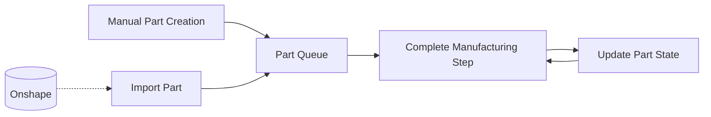
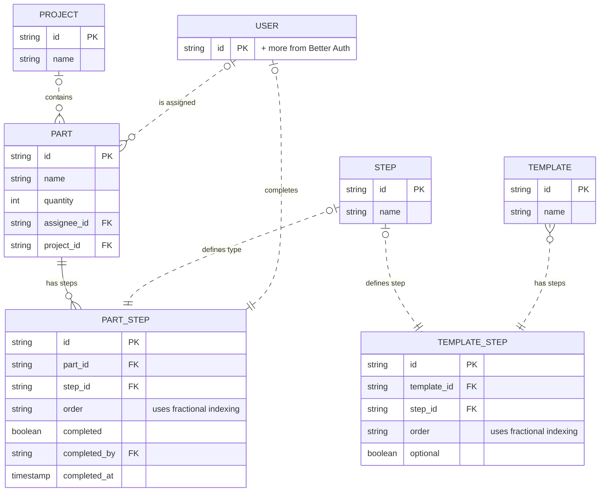

# Planning

The goal of this section is to explicitly state the goal and usage of this app, to help guide its development and plan its features.

## Goal

To increase transparency and communication within the team about production progress and needed work.

## How

To accomplish this goal, this project will create a simple, effective webapp.

### User Stories

User stories let us look at what users might want to do, then create features to do these tasks. Bold stories are part of the core functionality of the app, so should be part of any MVP.

* As a designer, I want to add parts into the system from Onshape so I can quickly add parts and associate drawings or other info with them.
* **As a team member, I want to add parts into the system manually (without Onshape) so I can track improvised or simple parts without needing CAD.**
* **As a manufacturer, I want to see what parts need to be done so I can pick what to work on.**
  * As a manufacturer (especially CNC operators), I want to be able to filter parts so I can work in batches
* As a project lead, I want to be able to visualize progress and see if things are falling behind.
* **As a manufacturer, I want to be able to mark parts as having completed a production step so everyone knows how much progress has been made on a part.**
* As a manufacturer, I want to be able to see basic, frequently referenced part info at a glance so I don't to check drawings or CAD.
* As a user (anyone would use this), I want to be able to create, assign parts to, and filter by projects to organize better and hide parts I don't care about.
* **As an advisory mentor, I want to be able to add and remove user accounts**
* **As a user, I want to be able to access the app in a secure, easy way.** (This could be through Onshape or Slack OAuth. Both are used by the entire technical side of the team)
* As a project lead, I want to be able to assign people to parts so I can make it clear who is responsible.
* As an advisory mentor, I want a log of how much and what each member has done to make sure everyone has the opportunity to help in production.
* As a manufacturer, I want to be able to access the app effectively on any device, especially on mobile.
* As a manufacturer, I want to attach files like CNC or 3DP gcode or drawings to parts so I can quickly access them wherever needed.
* Rework (part fails inspection)
* Partial completion (4 parts need to be built, 2 are on step 2 but 2 are on step 3)
* As a project lead, I want to flag parts as critical so manufacturers prioritize them.
* As a part assignee, I want to be notified when I am assigned to a part so I know what to focus on.
* As an advisory mentor, I want to be able to manage users' roles so I can set their permissions

### Core Workflow

## Roles and Permissions

| Action | General Student | Mentor | Project Lead | Keystone Captain | Advisory Mentor |

## What

What features need to be built:

### Stage 0: MVP

* Basic user system
* Manual part creation
* Part visualization
* Basic project system
* "Manufacturing" kanban view

#### Data Model

