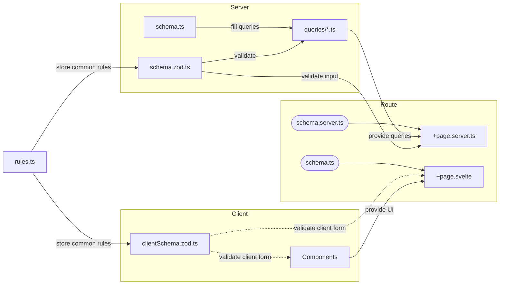

# Schema Locations

1. Database Schemas

These are the actual Drizzle Schemas and relations. They should only ever be accessed on the server for database queries

2. Zod Schemas

These have two main types: client and server. Client side Zod Schemas are really only used for client form validation. Server schemas are used for checking using user input.

3. Types

Used in components to declare the structure of data being passed.

## Import Structure

| File                  | Location   | Role                                                           |
| --------------------- | ---------- | -------------------------------------------------------------- |
| `schema.ts`           | Backend    | Store the Drizzle schemas and relations only                   |
| `rules.ts`            | Common Lib | Provide common zod rules                                       |
| `schema.zod.ts`       | Backend    | Zod schemas for the validating DB queries and user input[^1]   |
| `queries/*.ts`        | Backend    | Drizzle queries for the whole app split across table           |
| `clientSchema.zod.ts` | Client     | Zod schemas for the client side of forms and client side types |
| `schema(.server).ts`  | Route      | Schemas that are specific to that route                        |

[^1] This is primarily hand written schemas, only using Drizzle generated schema for very simple queries.
